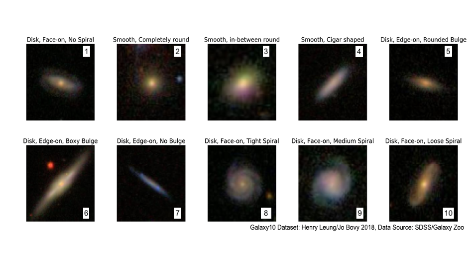

# Convolutional Neural Network (CNN) for galaxy morphological classification

In this project we use CNN to provide morphological classification of galaxies including in the SDSS survey (Sloan Digital Sky Survey). These galaxies have been classified morphologically using the [GalaxyZoo](https://www.zooniverse.org/projects/zookeeper/galaxy-zoo/) plataform using the so-called citizen-scientist. Briefly, the plataform presents to a user the image of a random galaxy with a comparison of typical morphological features of a galaxy (e.g., it is round-shaped? does it have arms? does it have a bar?). Given the fact for given galaxy this classification is performed by hundreds of users, it is significantly more robust in comparison to those derived by single or small group of astronomers. 

This project make use of the images reprocessed by the  [`astroNN`](https://astronn.readthedocs.io/en/latest/galaxy10sdss.html) package (see [Gharat & Dandawate, 2022](https://ui.adsabs.harvard.edu/abs/2022MNRAS.511.5120G/abstract), and [Leung and Bovy, 2019](https://ui.adsabs.harvard.edu/abs/2019MNRAS.483.3255L/abstract) for further information regarding tagging, and image downscaling). Here is an example of the images as well as the classification provided by the [`astroNN`](https://astronn.readthedocs.io/en/latest/galaxy10sdss.html) package:

In the notebook `CNN_galaxies.ipynb` we employ a CNN architecture as well as the metrics used to estimate the acquracy of the model. The Neural Network architecture consist of: 
* 2 convolutional leyer with 64 filters of 3x3 kernel size
* 1 maxpooling layer of 2x2 kernel size
* 1 convolutional leyer with 128 filters of 3x3 kernel size
* 1 maxpooling layer of 2x2 kernel size
* 1 convolutional leyer with 256 filters of 3x3 kernel size
* 1 maxpooling layer of 2x2 kernel size
* 1 Dropout of 0.5
* 2 dense layer of 150 and 60 neurons, respectively.
* 1 final dense leyer of 10

For the convolutional layers we use a relu activation function whereas for the dense layers we use a tanh activation function (except for the ouput layer where we use a softmax function).

Given the simplycity of the model and the training sample, this notebook can be run in colab. . This code was developed as the final project of the optative lecture 'Data analysis for astronomy' held at the UNAM Astronomy Institute during the 2023-fall term. Teachers: Joel Sanchez and Jorge Barrera. Students: Eric Macías Estrada, Mónica Alejandra Villa Durango, Valeria Quintero Ortega, and Aurora Mata Sánchez. 

# Results

## Metrics
In the below plots we show the Loss function (left panel) and accuracy (right panel) with respect to the epochs we train the CNN. 

The Loss function is used to quantify how good or bad we are doing the classification of our training set. In this case we use the cross entropy function. This function is usually used for classification tasks.  We train our CNN for 200 epochs. We note that as the epoch of training increases the Loss function dramatically decreases which is expected. However we also note that at the epoch 75 the Loss function using the validation set start to slightly increases. This suggest that, eventough the loss function is monotonicaly decreasing when we use the training set, there could be an overfitting in the training after this epoch.   

Another metrics we use is the accuracy. This is derived as the sum of the true positives and true negatives over the sum of the total values. Larger values of accuracty indicate that the CNN is learning better. The plot shows that as the epochs of training increases so does the accuracy of the training sample. However, we also note that after ~ 75 epochs the accuracy using the validation set does not significantly increases. As with the loss function, this indicates that after this epoch the CNN could be overfitting. This highlight the importance to use a validation set to better test the CNN. We achive accuracy values similar to those reported in  [Gharat & Dandawate, 2022](https://ui.adsabs.harvard.edu/abs/2022MNRAS.511.5120G/abstract).

## Confusion Matrix

The confusion matrix helps us to better cuantify how the Neural Network is performing the classification. The columns represent the true tags of the sample, whereas the rows represent the predicted tag from the CNN. In our case, the numbers corresponds to the classification presented in the figure above. If the network did a perfect job all the values in the diagonal of the matrix will be 100% and the rest should be 0%. As we can see this is not the case, we find values in the diagonal close to 90% but this is not the case for all the tags. This suggest the subtle differences in morphological classifation of galaxies. For instance the 

