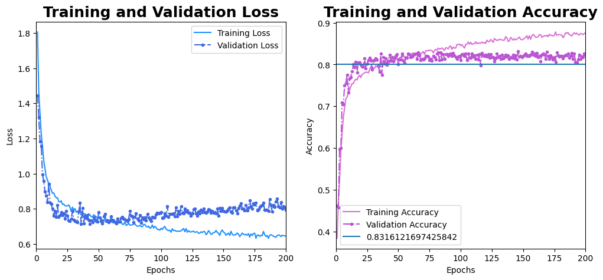
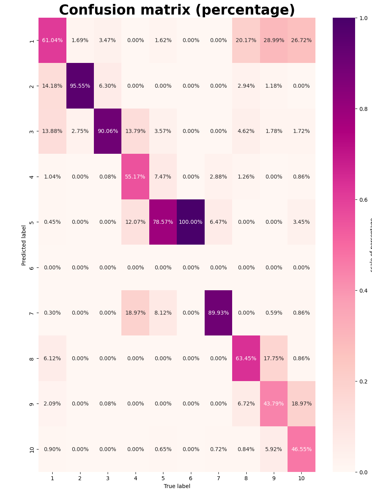

# Convolutional Neural Network (CNN) for galaxy morphological classification

In this project we use CNN to provide morphological classification of galaxies including in the SDSS survey (Sloan Digital Sky Survey). These galaxies have been classified morphologically using the [GalaxyZoo](https://www.zooniverse.org/projects/zookeeper/galaxy-zoo/) plataform using the so-called citizen-scientist. Briefly, the plataform presents to a user the image of a random galaxy with a comparison of typical morphological features of a galaxy (e.g., it is round-shaped? does it have arms? does it have a bar?). Given the fact for given galaxy this classification is performed by hundreds of users, it is significantly more robust in comparison to those derived by single or small group of astronomers. 

This project make use of the images reprocessed by the  [`astroNN`](https://astronn.readthedocs.io/en/latest/galaxy10sdss.html) package (see [Gharat & Dandawate, 2022](https://ui.adsabs.harvard.edu/abs/2022MNRAS.511.5120G/abstract), and [Leung and Bovy, 2019](https://ui.adsabs.harvard.edu/abs/2019MNRAS.483.3255L/abstract) for further information regarding tagging, and image downscaling). Here is an example of the images as well as the classification provided by the [`astroNN`](https://astronn.readthedocs.io/en/latest/galaxy10sdss.html) package:

In the notebook `CNN_galaxies.ipynb` we show the CNN architecture as well as the metrics used to estimate the acquracy of the model. Given the simplycity of the model and the training sample, this notebook can be run in colab. 

This code was developed as the final project of the optative lecture 'Data analysis for astronomy' held at the UNAM Astronomy Institute during the 2023-fall term. Teachers: Joel Sanchez and Jorge Barrera. Students: Eric Macías Estrada, Mónica Alejandra Villa Durango, Valeria Quintero Ortega, and Aurora Mata Sánchez. 

# Results

