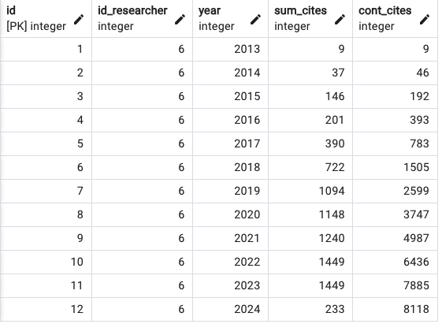

# Citation Metrics

## Data for a single researcher

### Bibliography Basics

The goal of this project is to build citation metrics for an astronomer (or a group of astronomers) using data from the [adsabs](https://ui.adsabs.harvard.edu/) website in SQL format. 

In this project we use the adsabs APIs designed to load the data that required to build SQL tables and subsequent queries. We follow the instructions from [Dmitry Savransky's notes](https://gist.github.com/dsavransky). 

In the notebook ```biblio_JBB.ipynb``` we use the adsabs API to request for the bibliographic information from all the articles where `'Jorge Barrera-Ballesteros'` is the (co-)author. The `request.get` function returns, among others, a json file where the metadata of the articles is retrived. For this query we obatin the information of 122 articles. We note that the number of entries (i.e., articles) vary depending on the string used for the name. For example using the string `'Jorge Barrera'` yields a total of 1602 entries. Of course, many of those do not correspond to the author we intent to search for. Since most of the researchers sign articles only with their first and last names, looking for researchers that sign with their full name is challenging. This is usually the case for spanish speaker researchers.

Since in python the json file can be treated as a dictionary we updated, and transform it to a csv file, accordingly (this is the `biblio.JBB.csv` file). These are the columns of the file:

* `id`: primary key
* `id_researcher`: researcher id from the institute table (secondary key)
* `bibcode`: adsabs identifier for the publication (string)
* `title`: publication title (string)
* `author`: list of all coauthors of the article (string array)
* `first_author`: last and first name of first author (string)
* `first_aff`: affiliation of the first author of the article (string)
* `citation_count`: accumuative number of citations (int) 

> **Note:**
>  In order to copy this csv file to a SQL table we had to manually change the `[]` symbols to `{}` in the `author` field. In very seldom cases, we also manually change the quotation symbol in this field from `""` to `'`. 

After correcting the previous file, we copy the file `biblio_JBB_rev.csv` to the table `bibliograpahy_JBB` located in local posgtgresql database (`inst_research`):
```
\copy bibliography_JBB FROM '/local/path/test_metrics_sel.csv' DELIMITER';' HEADER QUOTE'"' CSV
```

### Metrics

Once we have the bibcode of the researcher, we can send an API request to get the metrics for each of the bibcode ([see documentation here](https://github.com/adsabs/adsabs-dev-api/blob/master/API_documentation_Python/Metrics_API_Python.ipynb)). There is a wealth of meta information for each publication, however we focus in three fields: `bibcode`,`years`,`citations`, `reads`. Our goal is to derive from these fields the metrics such as h-index, citations per year and accumulative cites. 

Using the same notebook (```biblio_JBB.ipynb```) we call the API to request for the aforementioned fields. Similar to the bibliographic information, we translate the json dictionary to a dataframe to export to a csv file (`metrics_JBB.csv`). These are the columns of this file:

* `id`: primary key
* `id_researcher`: researcher id from the institute table (secondary key)
* `bibcode`: adsabs identifier for the publication (string)
* `years`: years since publication of the article (int array)
* `citations`: citations per year (int array)
* `reads`: number of reads per year (int array). This array does not have the same dimentions as the other two.

> **Note:**
>  Similar to the othe csv file we change  the `[]` symbols to `{}` in the fields with arrays.

After correcting the file, we copy the csv file to the database 

### SQL queries

Once we have copy the csv files to the tables in the postgresql database, we can use queries to create tables with the wanted metrics. The first table we want is the citation counts. We create a table using the following query:

``` sql 
CREATE TABLE cites(
	id SERIAL PRIMARY KEY,
	id_researcher INT, 	
	year INT, 
	sum_cites INT,
	cont_cites INT	
	);	
```

To populate the table we insert the query for each year:

```sql
INSERT INTO cites(id_researcher, year, sum_cites, cont_cites)
SELECT
	 6,tbl.u_years, tbl.sum_cites,sum(tbl.sum_cites) OVER (PARTITION BY aux ORDER BY tbl.u_years) AS cum_cites 
FROM (
	SELECT u_years, SUM(u_cites) AS sum_cites, 1 AS aux
	FROM (
		SELECT 
			id, 
			UNNEST(years) as u_years, 
			UNNEST(cites) as u_cites
		FROM metrics_jbb
		)
	GROUP BY u_years
	ORDER BY u_years ASC
	) AS tbl

```
This is the resulting table for this query:



